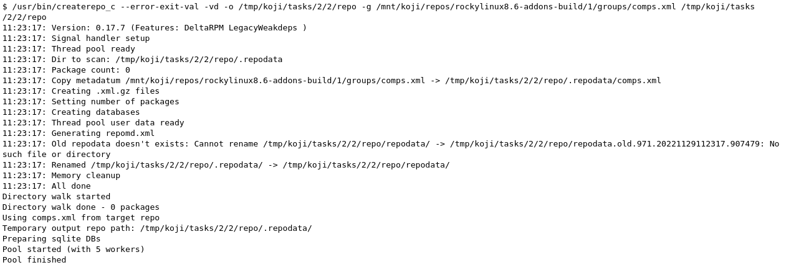

# createrepo工具使用


## 帮助信息

```
Usage:
  createrepo [OPTION?] <directory_to_index>

Program that creates a repomd (xml-based rpm metadata) repository from a set of rpms.

Help Options:
  -h, --help                                   Show help options
  --help-all                                   Show all help options
  --help-expert                                Expert (risky) options

Application Options:
  -V, --version                                Show program's version number and exit.
  -q, --quiet                                  Run quietly.
  -v, --verbose                                Run verbosely.
  -x, --excludes=PACKAGE_NAME_GLOB             Path patterns to exclude, can be specified multiple times.
  --basedir=BASEDIR                            Basedir for path to directories.
  -u, --baseurl=URL                            Optional base URL location for all files.
  -g, --groupfile=GROUPFILE                    Path to groupfile to include in metadata.
  -s, --checksum=CHECKSUM_TYPE                 Choose the checksum type used in repomd.xml and for packages in the metadata. The default is now "sha256".
  -p, --pretty                                 Make sure all xml generated is formatted (default)
  -d, --database                               Generate sqlite databases for use with yum.
  --no-database                                Do not generate sqlite databases in the repository.
  --update                                     If metadata already exists in the outputdir and an rpm is unchanged (based on file size and mtime) since the metadata was generated, reuse the existing metadata rather than recalculating it. In the case of a large repository with only a few new or modified rpms this can significantly reduce I/O and processing time.
  --update-md-path                             Existing metadata from this path are loaded and reused in addition to those present in the outputdir (works only with --update). Can be specified multiple times.
  --skip-stat                                  Skip the stat() call on a --update, assumes if the filename is the same then the file is still the same (only use this if you're fairly trusting or gullible).
  --split                                      Run in split media mode. Rather than pass a single directory, take a set ofdirectories corresponding to different volumes in a media set. Meta data is created in the first given directory
  -i, --pkglist=FILENAME                       Specify a text file which contains the complete list of files to include in the repository from the set found in the directory. File format is one package per line, no wildcards or globs.
  -n, --includepkg=PACKAGE                     Specify pkgs to include on the command line. Takes urls as well as local paths.
  -o, --outputdir=URL                          Optional output directory.
  -S, --skip-symlinks                          Ignore symlinks of packages.
  --changelog-limit=NUM                        Only import the last N changelog entries, from each rpm, into the metadata.
  --unique-md-filenames                        Include the file's checksum in the metadata filename, helps HTTP caching (default).
  --simple-md-filenames                        Do not include the file's checksum in the metadata filename.
  --retain-old-md=NUM                          Specify NUM to 0 to remove all repodata present in old repomd.xml or any other positive number to keep all old repodata. Use --compatibility flag to get the behavior of original createrepo: Keep around the latest (by timestamp) NUM copies of the old repodata (works only for primary, filelists, other and their DB variants).
  --distro=DISTRO                              Distro tag and optional cpeid: --distro'cpeid,textname'.
  --content=CONTENT_TAGS                       Tags for the content in the repository.
  --repo=REPO_TAGS                             Tags to describe the repository itself.
  --revision=REVISION                          User-specified revision for this repository.
  --set-timestamp-to-revision                  Set timestamp fields in repomd.xml and last modification times of created repodata to a value given with --revision. This requires --revision to be a timestamp formatted in 'date +%s' format.
  --read-pkgs-list=READ_PKGS_LIST              Output the paths to the pkgs actually read useful with --update.
  --workers                                    Number of workers to spawn to read rpms.
  --xz                                         Use xz for repodata compression.
  --compress-type=COMPRESSION_TYPE             Which compression type to use.
  --general-compress-type=COMPRESSION_TYPE     Which compression type to use (even for primary, filelists and other xml).
  --keep-all-metadata                          Keep all additional metadata (not primary, filelists and other xml or sqlite files, nor their compressed variants) from source repository during update (default).
  --discard-additional-metadata                Discard all additional metadata (not primary, filelists and other xml or sqlite files, nor their compressed variants) from source repository during update.
  --compatibility                              Enforce maximal compatibility with classical createrepo (Affects only: --retain-old-md).
  --retain-old-md-by-age=AGE                   During --update, remove all files in repodata/ which are older then the specified period of time. (e.g. '2h', '30d', ...). Available units (m - minutes, h - hours, d - days)
  -c, --cachedir=CACHEDIR.                     Set path to cache dir
  --deltas                                     Tells createrepo to generate deltarpms and the delta metadata.
  --oldpackagedirs=PATH                        Paths to look for older pkgs to delta against. Can be specified multiple times.
  --num-deltas=INT                             The number of older versions to make deltas against. Defaults to 1.
  --max-delta-rpm-size=MAX_DELTA_RPM_SIZE      Max size of an rpm that to run deltarpm against (in bytes).
  --local-sqlite                               Gen sqlite DBs locally (into a directory for temporary files). Sometimes, sqlite has a trouble to gen DBs on a NFS mount, use this option in such cases. This option could lead to a higher memory consumption if TMPDIR is set to /tmp or not set at all, because then the /tmp is used and /tmp dir is often a ramdisk.
  --cut-dirs=NUM                               Ignore NUM of directory components in location_href during repodata generation
  --location-prefix=PREFIX                     Append this prefix before location_href in output repodata
  --repomd-checksum=CHECKSUM_TYPE              Checksum type to be used in repomd.xml
  --error-exit-val                             Exit with retval 2 if there were any errors during processing
  --recycle-pkglist                            Read the list of packages from old metadata directory and re-use it.  This option is only useful with --update (complements --pkglist and friends).

```


## 最简单，最基本用法

```
createrepo .
```

会递归检索当前目录下所有rpm文件，读取信息汇总到repodata目录（无则创建，有则更新）下


## koji createrepo 命令解析

```
createrepo_c --error-exit-val -vd -o /tmp/test/repodata -g /tmp/test/comps.xml /tmp/test/repotoindex

* --error-exit-val                             Exit with retval 2 if there were any errors during processing
* -v, --verbose                                Run verbosely.
* -d, --database                               Generate sqlite databases for use with yum.
* -o, --outputdir=URL                          Optional output directory.
* -g, --groupfile=GROUPFILE                    Path to groupfile to include in metadata.


其中 /tmp/test/repodata 用来输出yum仓库元数据，目录必须已经存在，不存在不会创建，会报错退出
/tmp/test/repotoindex 用来指定待索引的目录，会递归目录所有rpm包，检出信息创建yum仓库元数据，该目录必须已经存在，不存在不会创建，会报错退出
```




其中-g是指定yum group，文件定义例子：

```
<?xml version="1.0"?>
<!DOCTYPE comps PUBLIC "-//Red Hat, Inc.//DTD Comps info//EN" "comps.dtd">

<!-- Auto-generated by the build system -->
<comps>
  <group>
    <id>build</id>
    <name>build</name>
    <description>None</description>
    <default>false</default>
    <uservisible>true</uservisible>
    <packagelist>
      <packagereq type="mandatory">bash</packagereq>
      <packagereq type="mandatory">bzip2</packagereq>
      <packagereq type="mandatory">coreutils</packagereq>
      <packagereq type="mandatory">cpio</packagereq>
      <packagereq type="mandatory">diffutils</packagereq>
      <packagereq type="mandatory">fedpkg</packagereq>
      <packagereq type="mandatory">findutils</packagereq>
      <packagereq type="mandatory">gawk</packagereq>
      <packagereq type="mandatory">gcc</packagereq>
      <packagereq type="mandatory">gcc-c++</packagereq>
      <packagereq type="mandatory">grep</packagereq>
      <packagereq type="mandatory">gzip</packagereq>
      <packagereq type="mandatory">info</packagereq>
      <packagereq type="mandatory">make</packagereq>
      <packagereq type="mandatory">patch</packagereq>
      <packagereq type="mandatory">redhat-rpm-config</packagereq>
      <packagereq type="mandatory">rocky-release</packagereq>
      <packagereq type="mandatory">rpm-build</packagereq>
      <packagereq type="mandatory">rpmdevtools</packagereq>
      <packagereq type="mandatory">ruby</packagereq>
      <packagereq type="mandatory">sed</packagereq>
      <packagereq type="mandatory">shadow-utils</packagereq>
      <packagereq type="mandatory">tar</packagereq>
      <packagereq type="mandatory">unzip</packagereq>
      <packagereq type="mandatory">util-linux</packagereq>
      <packagereq type="mandatory">which</packagereq>
      <packagereq type="mandatory">xz</packagereq>
    </packagelist>
  </group>
  <group>
    <id>srpm-build</id>
    <name>srpm-build</name>
    <description>None</description>
    <default>false</default>
    <uservisible>true</uservisible>
    <packagelist>
      <packagereq type="mandatory">bash</packagereq>
      <packagereq type="mandatory">bzip2</packagereq>
      <packagereq type="mandatory">coreutils</packagereq>
      <packagereq type="mandatory">cpio</packagereq>
      <packagereq type="mandatory">diffutils</packagereq>
      <packagereq type="mandatory">fedpkg</packagereq>
      <packagereq type="mandatory">findutils</packagereq>
      <packagereq type="mandatory">gawk</packagereq>
      <packagereq type="mandatory">gcc</packagereq>
      <packagereq type="mandatory">gcc-c++</packagereq>
      <packagereq type="mandatory">grep</packagereq>
      <packagereq type="mandatory">gzip</packagereq>
      <packagereq type="mandatory">info</packagereq>
      <packagereq type="mandatory">make</packagereq>
      <packagereq type="mandatory">patch</packagereq>
      <packagereq type="mandatory">redhat-rpm-config</packagereq>
      <packagereq type="mandatory">rocky-release</packagereq>
      <packagereq type="mandatory">rpm-build</packagereq>
      <packagereq type="mandatory">rpmdevtools</packagereq>
      <packagereq type="mandatory">ruby</packagereq>
      <packagereq type="mandatory">sed</packagereq>
      <packagereq type="mandatory">shadow-utils</packagereq>
      <packagereq type="mandatory">tar</packagereq>
      <packagereq type="mandatory">unzip</packagereq>
      <packagereq type="mandatory">util-linux</packagereq>
      <packagereq type="mandatory">which</packagereq>
      <packagereq type="mandatory">xz</packagereq>
    </packagelist>
  </group>
</comps>

```


---
