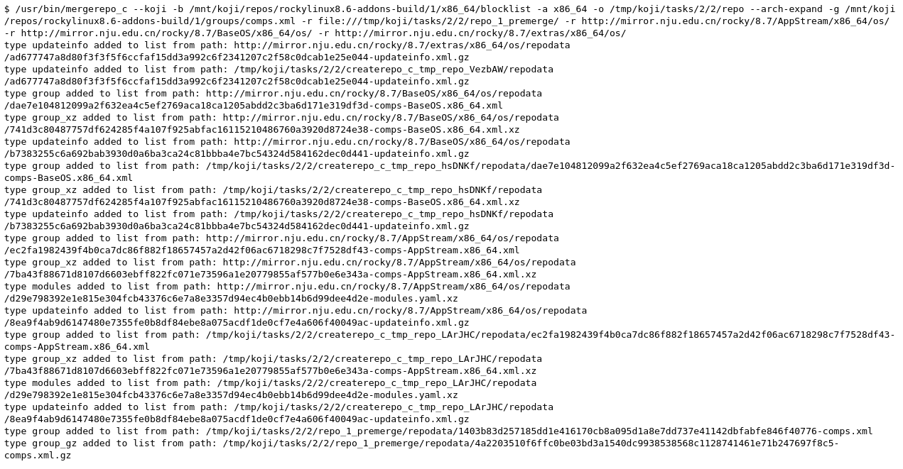

# mergerepo工具使用

```
Usage:
  mergerepo [OPTION?] --repo=url --repo=url

Take one or more repositories and merge their metadata into a new repo

Help Options:
  -h, --help                           Show help options

Application Options:
  --version                            Show program's version number and exit
  -r, --repo=REPOS                     Repo url
  --repo-prefix-search=OLD_PREFIX      Repository prefix to be replaced by NEW_PREFIX.
  --repo-prefix-replace=NEW_PREFIX     Repository prefix URL by which the OLD_PREFIX is replaced.
  -a, --archlist=ARCHLIST              Defaults to all arches - otherwise specify arches
  -d, --database                       
  --no-database                        
  -v, --verbose                        
  -o, --outputdir=OUTPUTDIR            Location to create the repository
  --nogroups                           Do not merge group (comps) metadata
  --noupdateinfo                       Do not merge updateinfo metadata
  --compress-type=COMPRESS_TYPE        Which compression type to use
  --method=MERGE_METHOD                Specify merge method for packages with the same name and arch (available merge methods: repo (default), ts, nvr)
  --all                                Include all packages with the same name and arch if version or release is different. If used --method argument is ignored!
  --noarch-repo=URL                    Packages with noarch architecture will be replaced by package from this repo if exists in it.
  --unique-md-filenames                Include the file's checksum in the metadata filename, helps HTTP caching (default).
  --simple-md-filenames                Do not include the file's checksum in the metadata filename.
  --omit-baseurl                       Don't add a baseurl to packages that don't have one before.
  -k, --koji                           Enable koji mergerepos behaviour. (Optionally select simple mode with: --simple)
  --simple                             Enable koji specific simple merge mode where we keep even packages with identical NEVRAs. Only works with combination with --koji/-k.
  --pkgorigins                         Enable standard mergerepos behavior while also providing the pkgorigins file for koji.
  --arch-expand                        Add multilib architectures for specified archlist and expand all of them. Only works with combination with --archlist.
  -g, --groupfile=GROUPFILE            Path to groupfile to include in metadata.
  -b, --blocked=FILE                   A file containing a list of srpm names to exclude from the merged repo. Only works with combination with --koji/-k.
```


## koji mergerepo操作解析

```

rm -rf /tmp/test/repo && mkdir -p /tmp/test/repo
rm -rf /tmp/test/repotoindex && mkdir -p /tmp/test/repotoindex

createrepo_c --error-exit-val -vd -o /tmp/test/repo -g /tmp/test/comps.xml /tmp/test/repotoindex

echo > /tmp/test/blocklist

/usr/bin/mergerepo_c --koji -b /tmp/test/blocklist -a x86_64 -o /tmp/test/repo --arch-expand -g /tmp/test/comps.xml -r file:///tmp/koji/tasks/2/2/repo_1_premerge/ -r http://mirror.nju.edu.cn/rocky/8.7/AppStream/x86_64/os/ -r http://mirror.nju.edu.cn/rocky/8.7/BaseOS/x86_64/os/ -r http://mirror.nju.edu.cn/rocky/8.7/extras/x86_64/os/


* -k, --koji                           Enable koji mergerepos behaviour. (Optionally select simple mode with: --simple)
* -r, --repo=REPOS                     Repo url
* -b, --blocked=FILE                   A file containing a list of srpm names to exclude from the merged repo. Only works with combination with --koji/-k.
* -g, --groupfile=GROUPFILE            Path to groupfile to include in metadata.
* --arch-expand                        Add multilib architectures for specified archlist and expand all of them. Only works with combination with --archlist.
* --pkgorigins                         Enable standard mergerepos behavior while also providing the pkgorigins file for koji.
```





这里merge有个模式需要注意，不同模式对包的处理不一样


---
